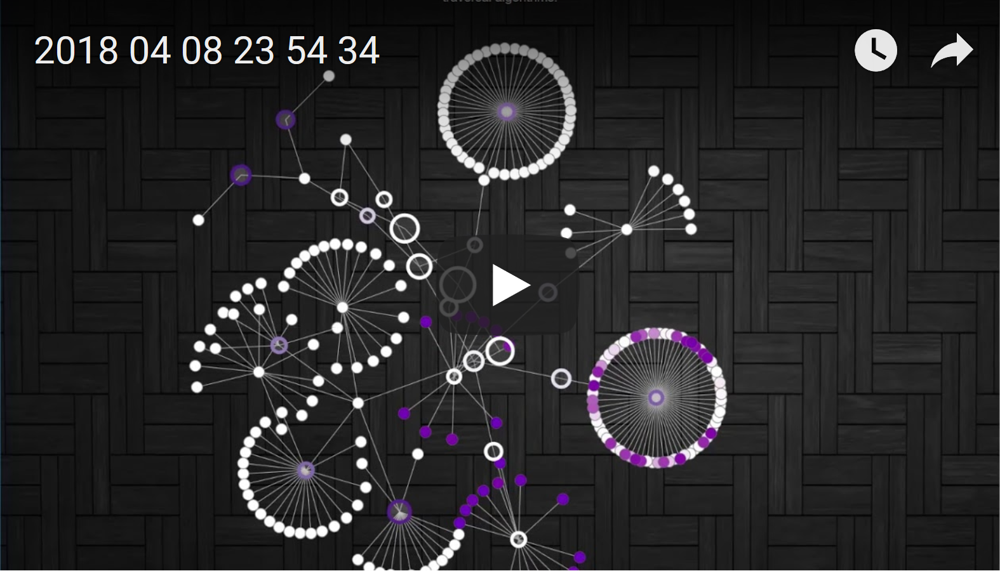
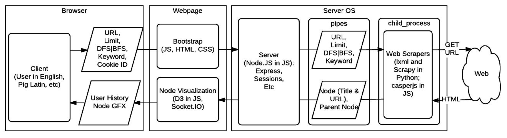

# Crawlr

<p align="center">
<a href="https://youtu.be/yHv8RUs1N2c">

</a>
</p>

## Overview
The Crawlr is a relative search engine that graphically searches 
for an optional search term from a starting URL up until a certain URL depth limit 
using breadth-first-search or depth-first-search techniques.  The search paths are 
visually displayed in either a collapsible force-layout or a pack hierarchy layout.
  A multithreaded synchronous lxml based scrapper or a asynchronous scrapy based 
scraper can be used to discover the path.

## Crawlr Links
[Crawlr Site](http://159.89.136.195:8080/)<br>
[Crawlr Report](CrawlerReport.PDF)

## User Instructions

#### Start Scraping
1. Go [here](http://159.89.136.195:8080/)
2. Input a starting URL. (e.g., http://www.sciencekids.co.nz/sciencefacts/animals/cat.html)
3. <OPTIONAL> Input the desired keyword (the scraper will halt on discovery).
4. Input the number of levels to traverse (must be greater than 0).
5. Select a search type (BFS, DFS, or Single-Path DFS)
6. <OPTIONAL> Specify the desired scraper (HTML, JS, or Scrapy)
7. We suggest testing on HTML or Scrapy first since JS has had some memory issues
8. Click “Crawl” (Graph will generate).

#### Post-Scraping (Force Layout) 
1. Hover on node for tooltip (displays title and url).
2. Single-click on parent nodes that are collapsed (helps condense large graphs)
3. Right click on nodes to open associated web pages.
4. Use scroll-wheel to zoom in and out of visualization.
5. Click on an empty space outside of nodes or edges and hold to drag, or pan the graph side to side

#### Post-Scraping (Pack Hierarchy Layout) 
1. Hover on node for tooltip (displays title and url).
2. Single-click on parent node for zoom to next level. 
3. Single-click to side of parent node for zoom back to previous level.
4. Double-click on nodes to open associated web pages.

#### Search History
1. Refresh page (this generates the user’s search history)
2. Select option from dropdown (this automatically populates user inputs with past info)
3. Click “Clear History” (this deletes the search history corresponding to the user’s cookie)

## Software Architecture


## Software Libraries
- Node.js
  - Express (web framework)
  - Express-handlebars (html templating)
  - Express-session
  - Body-parser (parses bodies, e.g. POST requests)
  - Http (server)
  - JSONStream
  - Socket.IO (used to create persistent connection for uploading links to client real-time, http://socket.io/ )
  - Socket.io-client (used to receive links real-time on client)
  - Python-shell (used to integrate child-processes into nodejs)
- Bootstrap (used for frontend js, html, and css)
- jQuery
- Python
  - Lxml (fast c-based html and xml parsing library)
  - Bs4 (used for their Unicode conversion library from bad html)
  - Requests (http connection library)
  - Scrapy (awesome production level scraping module)
  - Cssselect (selecting elements by css)
- D3.js (used for visuals)

## Host on Ubuntu (requires sudo):

```chmod +x setup
./setup
node index.js
```

## Credits
- Chris Kirchner
- Christiano Vannellic
- Himal Patel

